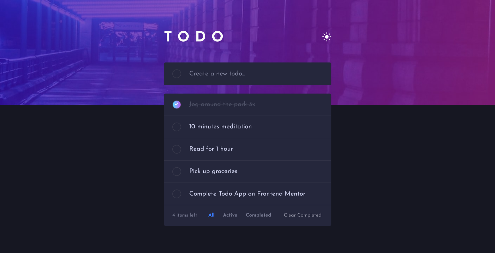

# Frontend Mentor - Todo app solution

This is a solution to the [Todo app challenge on Frontend Mentor](https://www.frontendmentor.io/challenges/todo-app-Su1_KokOW). Frontend Mentor challenges help you improve your coding skills by building realistic projects. 

## Table of contents

- [Overview](#overview)
  - [The challenge](#the-challenge)
  - [Screenshot](#screenshot)
  - [Links](#links)
- [My process](#my-process)
  - [Built with](#built-with)
  - [What I learned](#what-i-learned)
  - [Continued development](#continued-development)
  - [Useful resources](#useful-resources)
- [Author](#author)

## Overview

### The challenge

Users should be able to:

- View the optimal layout for the app depending on their device's screen size
- See hover states for all interactive elements on the page
- Add new todos to the list
- Mark todos as complete
- Delete todos from the list
- Filter by all/active/complete todos
- Clear all completed todos
- Toggle light and dark mode
- **Bonus**: Drag and drop to reorder items on the list

### Screenshot

### Links

- Solution URL: [https://github.com/notanut/todo-app.git](https://github.com/notanut/todo-app.git)
- Live Site URL: [https://notanut.github.io/todo-app/](https://notanut.github.io/todo-app/)

## My process

### Built with

- Semantic HTML5 markup
- CSS custom properties
- Flexbox
- SCSS
- [React](https://reactjs.org/) - JS library

### What I learned

I just learn how to use local storage, and never thought it was that easy! I also try to use SCSS for the first time, it helped me a lot to build the project faster. 

### Continued development

Still, I wanna master my React JS skill. Wanna give Next a try though!

### Useful resources

- [CRUD APP TUTORIAL](https://www.taniarascia.com/crud-app-in-react-with-hooks/) - I learned basic stuffs on how making a CRUD App.
- [MDN Conditional Rendering](https://developer.mozilla.org/en-US/docs/Learn/Tools_and_testing/Client-side_JavaScript_frameworks/React_interactivity_filtering_conditional_rendering) - I was stuck in the middle about how can I do the conditional rendering. This article helped me a lot. Thank you MDN!

## Author

- Website - [Natasya](https://projects-nat.netlify.app/)
- Frontend Mentor - [@notanut](https://www.frontendmentor.io/profile/notanut)